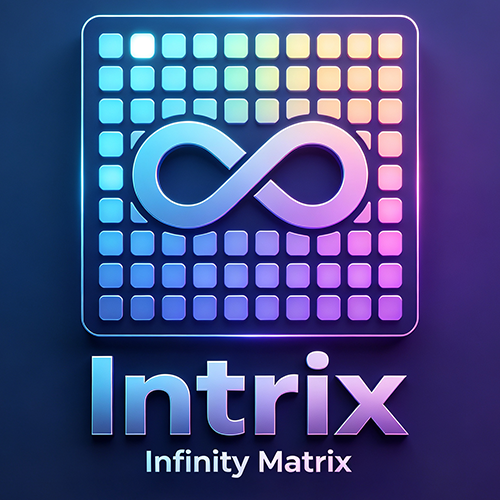
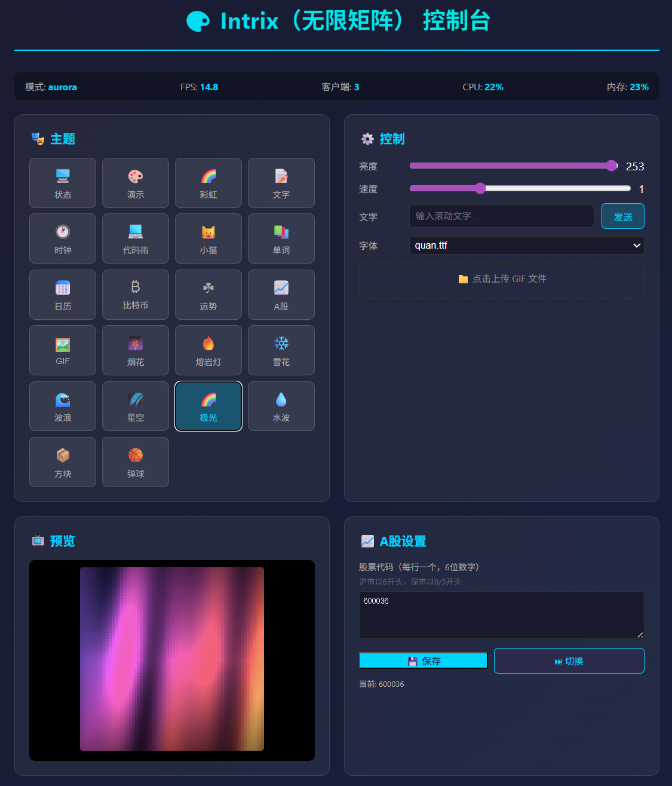

# Intrix Seed

<p align="center">
  
</p>

一个跑在 Mac mini / 树莓派上的 **64×64 RGB LED 点阵屏服务端**，用 Python + Flask 写成，
通过 TCP 把画面推给点阵屏，同时提供 Web 控制台切换主题、改配置、看状态。

> **像素人生（pixellife）只是其中一个主题** —— 除此之外还有 bitcoin / stock / pearl /
> gifclock / cyberclock / kitten / fireworks / lava / vocab / calendar 等 20 多个主题，
> 全部由同一份 `server.py` 承载，通过 `themes/theme_manager.py` 调度。



---

## 快速开始

```bash
# 依赖：Python 3.8+，只用 Flask / Pillow / requests / numpy 等常见库
pip install flask pillow requests numpy

python3 server.py
```

| 入口 | 地址 |
|---|---|
| Web 控制台 | `http://localhost:5050` |
| 硬件 TCP（点阵屏） | `0.0.0.0:8080` |

Web 控制台里可以实时预览每个主题的 64×64 画面、切换屏幕当前主题，
也能给每块屏单独指定主题（按客户端 IP 记忆）。TCP 协议与全部 REST 接口见
[`Intrix_API_Guide.md`](Intrix_API_Guide.md)。

> ESP32 驱动端固件不在此仓库中（未开源）。本仓库只包含服务端代码。

## 目录结构

```
server.py                 # 主服务：HTTP 面板 + TCP 推流 + 全部 REST 接口
themes/                   # 主题集合（每个文件一个 draw(frame, t) 实现）
  theme_manager.py        # 主题注册与调度
pixellife/                # 像素人生：最完整的一个「有生命」的主题
  world.py                #   世界状态机：体力/心情/金钱/时间推进
  brain.py                #   LLM 决策：主角下一步干什么
  social.py               #   NPC 偶遇与对话生成
  memory.py               #   长期记忆、日记、愿望清单
  renderer.py             #   把世界状态画成 64×64 帧
  hud.py / subtitle.py    #   顶部状态栏 / 底部滚动字幕
  feeds.py                #   外部信息：新闻 / 天气 / 抖音·小红书·B站热榜
  worldlog.py             #   世界日志：按天归档外部世界，上限 10000 天
  herochat.py             #   后台与主角对话（影响心情/记忆/下一步行动）
  llm.py                  #   OpenAI 兼容后端的线程池封装
Intrix_API_Guide.md       # TCP 协议与 REST 接口文档
```

## 像素人生是什么

屏幕里住着一个小人。他会自己决定下一步做什么（吃饭、看书、出门散步、上班、睡觉），
体力、心情、金钱随时间流逝变化。他会：

- **读世界**：每天抓取新闻 / 天气 / 抖音·小红书·B站热榜，这些既是他屏幕上的信息，
  也是他聊天和决策的上下文；所有外部内容按天写进 **世界日志**（`pixellife/worldlog/`，
  最多保存 10000 天），他会回忆前几天发生了什么。
- **跟 NPC 聊天**：走进搭话范围的 NPC 会触发 LLM 生成的对话，屏幕弹出气泡。
- **跟你对话**：Web 控制台「💬 和主角说话」可以直接对他说一句话，AI 回复会显示在屏幕底栏，
  同时改变他的心情、写进他的记忆，甚至改变他下一步的行动。
- **有天气特效**：下雨 / 下雪时户外场景会有粒子效果；左上角的天气图标显示当日最高/最低温。

LLM 是可选项 —— 关掉之后他仍然会按规则生活，只是不会说话和思考。

## LLM 配置

任何 **OpenAI 兼容后端**都可以（本地 llama.cpp / Ollama / vLLM 都行）。
复制模板后填上自己的地址和 key（该文件已在 `.gitignore` 中，不会被提交）：

```bash
cp pixellife/llm_config.example.json pixellife/llm_config.json
```

同样适用于新闻/热榜配置 `feeds_config.json` 与世界日志 `worldlog_config.json`。
Web 控制台「🧠 AI 大脑」卡片里也可以直接改，改完即时生效。

默认的几个数据源全部**免费、无需注册**：

| 用途 | 数据源 | 说明 |
|---|---|---|
| 天气 | `api.open-meteo.com` | 免 key，支持中文城市名自动定位经纬度 |
| 新闻 | `60s.viki.moe/v2/60s` | 免 key，每日 60 秒读世界 |
| 抖音热榜 | `60s.viki.moe/v2/douyin` | 免 key |
| 小红书热榜 | `60s.viki.moe/v2/rednote` | 免 key |
| B 站热搜 | `api.bilibili.com/.../search/square` | 官方接口，免 key 免登录 |

## 部署为常驻服务（macOS launchd）

```bash
launchctl kickstart -k gui/$(id -u)/com.jem.intrix.led
```

Linux 上换成对应的 systemd unit 即可。

## 版本历史

详见 [Releases](../../releases)。

## License

MIT
